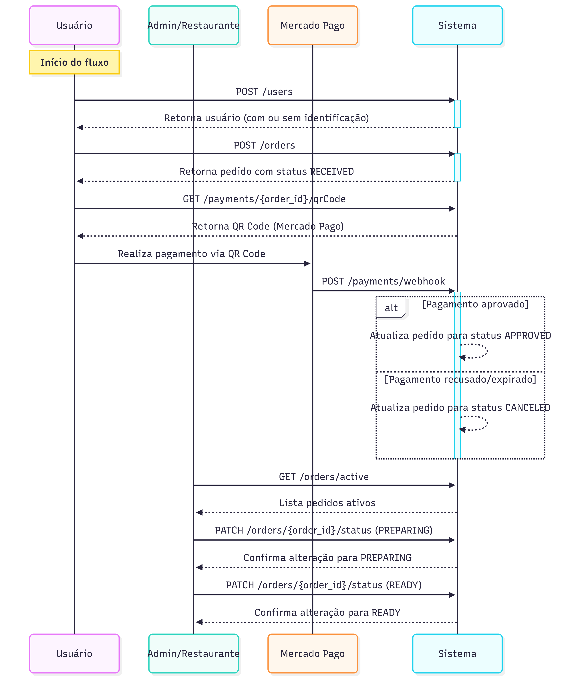
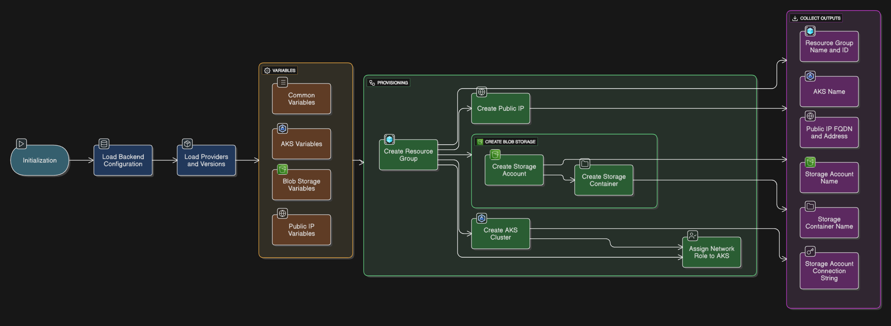
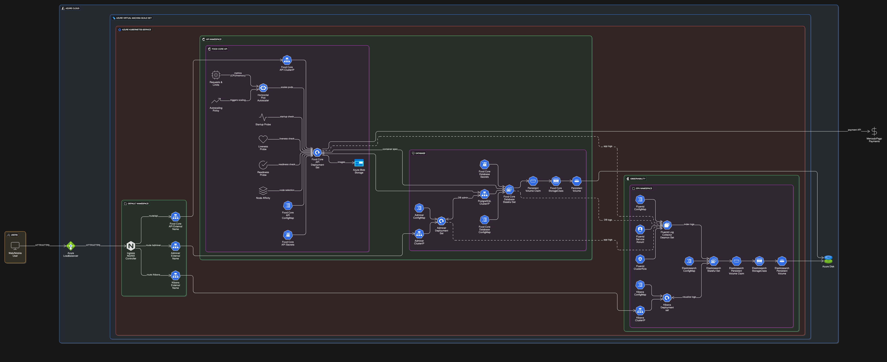

# 🍔 Food Core API

<div align="center">

[](https://sonarcloud.io/summary/new_code?id=FIAP-SOAT-TECH-TEAM_food-core-api)
[](https://sonarcloud.io/summary/new_code?id=FIAP-SOAT-TECH-TEAM_food-core-api)
[](https://sonarcloud.io/summary/new_code?id=FIAP-SOAT-TECH-TEAM_food-core-api)
[](https://sonarcloud.io/summary/new_code?id=FIAP-SOAT-TECH-TEAM_food-core-api)
[](https://sonarcloud.io/summary/new_code?id=FIAP-SOAT-TECH-TEAM_food-core-api)
[](https://sonarcloud.io/summary/new_code?id=FIAP-SOAT-TECH-TEAM_food-core-api)
[](https://sonarcloud.io/summary/new_code?id=FIAP-SOAT-TECH-TEAM_food-core-api)
</div>

API de gerenciamento de pedidos para restaurantes fast-food, desenvolvida como parte do curso de Arquitetura de Software
da FIAP (Tech Challenge).

<div align="center">
  <a href="#visao-geral">Visão Geral</a> •
  <a href="#arquitetura">Arquitetura</a> •
  <a href="#tecnologias">Tecnologias</a> •
  <a href="#diagramas">Diagramas</a> •
  <a href="#eventstorming">Event Storming</a> •
  <a href="#taskboard">Task Board</a> •
  <a href="#dicionario">Dicionário de linguagem ubíqua</a>
  <a href="#instalacao-e-uso">Instalação e Uso</a> •
  <a href="#provisionamento-na-nuvem">Provisionar o projeto na nuvem</a> •
  <a href="#estrutura-do-projeto">Estrutura do Projeto</a> • <br/>
  <a href="#apis">APIs</a> •
  <a href="#banco-de-dados">Banco de Dados</a> •
  <a href="#resolucao-de-problemas">Resolução de Problemas</a> •
  <a href="#contribuicao-e-licenca">Contribuição e Licença</a>
</div>

<h2 id="visao-geral">📋 Visão Geral</h2>

O sistema implementa um serviço de auto-atendimento para uma lanchonete de fast-food, permitindo que os clientes façam
pedidos e acompanhem o status do seu pedido sem a necessidade de interação com um atendente. A aplicação também inclui
um painel administrativo para gerenciamento de produtos, clientes e acompanhamento de pedidos.

### Principais recursos

- **Auto-atendimento**: Interface para clientes realizarem pedidos
- **Identificação de cliente**: Por CPF ou cadastro com nome e e-mail
- **Pagamento integrado**: Via QRCode do Mercado Pago
- **Acompanhamento de pedido**: Status em tempo real (Recebido, Em preparação, Pronto, Finalizado)
- **Painel administrativo**: Gerenciamento de produtos, categorias e pedidos

## 🧱 Arquitetura

<details>
<summary>Expandir para mais detalhes</summary>

Este projeto segue os princípios da **Arquitetura Limpa (Clean Architecture)** com o objetivo de manter um core de negócio independente, purista e facilmente testável. O desenho modular segue uma separação clara de responsabilidades entre camadas, respeitando dependências unidirecionais e regras de isolamento.

### 🎯 Princípios Adotados

- O **core** (domain, application e interface adapters) **não possui dependências de frameworks**
- O uso de bibliotecas externas (como Spring, MapStruct ou JPA) está **restrito à infraestrutura**
- Todas as interfaces de entrada e saída são representadas por **portas (interfaces)** no core
- O fluxo é baseado em **casos de uso (UseCases)** acionados por adaptadores de interface
- As comunicações são feitas por **gateways**, permitindo **inversão de dependência**
- A arquitetura permite **extração futura para microsserviços**, sem acoplamento com tecnologias específicas

---

### 📐 Diagrama de Fluxo



### Monolito Modular (Spring Modulith)

A aplicação é estruturada como um monolito modular usando Spring Modulith, com contextos limitados (bounded contexts)
bem definidos para cada domínio de negócio:



Cada módulo:

- É autocontido, com seus próprios adaptadores, portas e domínio
- Comunica-se com outros módulos através de eventos de domínio
- Pode ser extraído como um serviço independente no futuro

### Eventos de Domínio

O sistema utiliza eventos de domínio assíncronos entre módulos, permitindo:

- Comunicação desacoplada
- Notificações entre contextos limitados
- Fácil migração para uma arquitetura distribuída no futuro

</details>

<h2 id="tecnologias">🔧 Tecnologias</h2>

<details>
<summary>Expandir para mais detalhes</summary>

### Backend

- **Java 21**: Linguagem principal
- **Spring Boot 3.4**: Framework base
- **Spring Modulith**: Para organização modular da aplicação
- **Spring Data JPA**: Persistência e acesso a dados
- **Spring Security**: Segurança e autenticação
- **MapStruct**: Mapeamento entre DTOs e entidades
- **Lombok**: Redução de código boilerplate

### Banco de Dados

- **PostgreSQL**: Banco de dados relacional principal
- **Liquibase**: Migrações de banco de dados

### Infraestrutura & Observabilidade

- **Docker**: Containerização
- **Docker Compose**: Orquestração de containers
- **Kubernetes (AKS)**: Orquestração de containers em produção
- **Terraform**: Provisionamento de infraestrutura como código
- **Gradle**: Gerenciamento de dependências e builds
- **SonarQube/SonarCloud**: Análise estática de código
- **Azure DevOps**: Armazenamento de imagens com o Azure Blob Storage
- **GitHub Actions**: CI/CD
- **Swagger/OpenAPI**: Documentação de API

### Integração

- **Mercado Pago API**: Processamento de pagamentos

</details>

<h2 id="diagramas">📊 Diagramas</h2>

<details>
<summary>Expandir para mais detalhes</summary>

### Modelo de Domínio



### DER (Diagrama Entidade-Relacionamento)




### Fluxo de Realização do Pedido e Pagamento (Event Storming)



### Fluxo de Preparação e Entrega do Pedido (Event Storming)



### Fluxo de compra e pagamento (Event Storming)


### Infraestrutura como Código (Terraform)



### Kubernetes



</details>

<h2 id="eventstorming"> 💡Event Storming</h2>
<details>
<summary>Expandir para mais detalhes</summary>

### Event Storming Miro

- https://miro.com/app/board/uXjVIAFD_zg=/?share_link_id=933422566141


</details>


<h2 id="taskboard"> 📌Task Board</h2>
<details>
<summary>Expandir para mais detalhes</summary>

### Board de tarefas Linear App


</details>

<h2 id="dicionario">📖 Dicionário de linguagem ubíqua</h2>
<details>
<summary>Expandir para mais detalhes</summary>

### Termos essenciais para a aplicação

- **Admin (Administrador)**
  Usuário com privilégios elevados, responsável pela gestão de usuários, permissões e configurações do sistema.

- **Adquirente**
  Instituição financeira responsável por processar transações de pagamento do sistema. No nosso caso, a adquirente é
  representada pela integração com o [Mercado Pago](https://www.mercadopago.com.br).

- **Authentication (Autenticação)**
  Processo de validação da identidade de um usuário por meio de login.

- **Authorization (Autorização)**
  Controle de acesso baseado em permissões e papéis (roles). Exemplo: apenas administradores podem listar todos os
  usuários.

- **Catalog (Catálogo de Produtos)**
  Conjunto organizado dos produtos disponíveis para seleção e montagem de pedidos.

- **Category (Categoria)**
  Classificação dos produtos por tipo (ex.: lanches, bebidas, sobremesas).

- **Combo**
  Conjunto personalizado por um cliente, composto por: lanche, acompanhamento, bebida e sobremesa.

- **Customer (Cliente)**
  Pessoa que realiza um pedido no sistema. Pode se identificar com CPF, cadastrar nome/e-mail ou seguir como convidado (
  guest).

- **Guest (Convidado)**
  Cliente que realiza um pedido sem se identificar ou criar conta. Atua como usuário temporário.

- **Mercado Pago Integration (Integração com Mercado Pago)**
  Serviço externo utilizado para processar pagamentos eletrônicos dos pedidos.

- **Order (Pedido)**
  Conjunto de itens selecionados por um cliente para consumo. Pode incluir um ou mais combos.

- **Order Item (Item do Pedido)**
  Produto específico dentro de um pedido. Pode ser parte de um combo ou avulso.

- **Payment (Pagamento)**
  Etapa posterior à finalização do pedido. Utiliza integração com o Mercado Pago para processar as transações
  financeiras.

- **Expiração (Pagamento)**
  Tempo de expiração para pagamento de QrCode gerado pelo adquirente. Por padrão, 30 minutos, após esgotar o tempo o
  pedido relacionado é cancelado.

- **Product (Produto)**
  Qualquer item disponível para venda, como lanches, bebidas, sobremesas ou acompanhamentos.

- **Role (Papel)**
  Função atribuída a um usuário. Define suas permissões de acesso no sistema (ex.: ADMIN, ATENDENTE, GUEST).

- **Status do Pedido**
  Representa o estado atual de um pedido. Exemplos: *Em preparação*, *Pronto*, *Entregue*, *Cancelado*.

- **Stock (Estoque)**
  Representa a quantidade disponível de cada produto no sistema.

- **TID (Transaction ID)**
  Identificador único de uma transação na adquirente, fornecido após o pagamento.

- **User (Usuário)**
  Pessoa autenticada no sistema. Pode possuir diferentes papéis, como ADMIN, ATENDENTE ou GUEST.

</details>

<h2 id="instalacao-e-uso">🚀 Instalação e Uso</h2>

<details>
<summary>Expandir para mais detalhes</summary>

### Requisitos

- Docker e Docker Compose
- Ngrok (para testes locais de webhook)
- JDK 21+
- Gradle 8.0+

### Script Centralizador `food`

O projeto utiliza um script centralizador `food` para gerenciar todas as operações:

```bash
./food [comando] [opções]
```

#### Comandos Principais

| Comando       | Descrição                                           |
|---------------|-----------------------------------------------------|
| `start:all`   | Inicia toda a infraestrutura e a aplicação          |
| `start:infra` | Inicia apenas a infraestrutura (banco)              |
| `start:app`   | Inicia apenas a aplicação                           |
| `stop:all`    | Para todos os serviços                              |
| `stop:infra`  | Para apenas a infraestrutura                        |
| `stop:app`    | Para apenas a aplicação                             |
| `restart:all` | Reinicia todos os serviços                          |
| `restart:app` | Reinicia apenas a aplicação                         |
| `db:up`       | Aplica migrações do banco de dados                  |
| `db:reset`    | Reseta o banco de dados                             |
| `logs`        | Exibe logs dos containers                           |
| `logs:app`    | Exibe logs apenas da aplicação                      |
| `logs:db`     | Exibe logs apenas do banco de dados                 |
| `status`      | Exibe status dos containers                         |
| `clean`       | Remove containers, imagens e volumes não utilizados |
| `help`        | Exibe a mensagem de ajuda                           |

#### Opções

- `--build`, `-b`: Reconstrói as imagens antes de iniciar
- `--force`, `-f`: Força a execução sem confirmação

### Iniciando o Ambiente do Zero

```bash
# Clone o repositório
git clone https://github.com/soat-fiap/food-core-api.git
cd food-core-api

# Tornar o script principal executável
chmod +x food

# Iniciar infraestrutura (banco, adminer)
./food start:infra

# Resetar e configurar o banco de dados
./food db:reset

# Iniciar a aplicação
./food start:app --build

# Ou iniciar tudo de uma vez
./food start:all --build
```

### 🛠️ Como configurar o ambiente local com Ngrok

Para que sua aplicação local receba os webhooks de forma funcional (especialmente em endpoints que estão em `localhost`), é necessário utilizar o [Ngrok](https://ngrok.com/).

### ⚙️ Passo a passo para configurar o Ngrok

1. **Baixe o Ngrok:**
    - Acesse: [https://ngrok.com/download](https://ngrok.com/download) e faça o download de acordo com seu sistema operacional.

2. **Instale e autentique o Ngrok (apenas na primeira vez):**
   ```bash
   ngrok config add-authtoken SEU_TOKEN_DO_NGROK

3. **Exponha a porta da aplicação (ex: 8085):**
   ```bash
   ngrok http 8085
   ```

4. **Copie o link gerado:**
    - O Ngrok irá gerar uma URL do tipo `https://abc123.ngrok.io` que redireciona para `http://localhost:8085`.

5. **Atualize o application.properties:**
    - No arquivo `application.properties`, adicione a URL do Ngrok como base para os webhooks:
   ```properties
   mercado-pago.notification-url=https://abc123.ngrok.io/api/payments/webhook
   ```
   Se quiser, você pode definir a URL do Ngrok como variável de ambiente:
   ```bash
    export MERCADO_PAGO_NOTIFICATION_URL=https://sua-url-do-ngrok.ngrok.io/api/payments/webhook
    ```

### Acessando a Aplicação

- **API**: <http://localhost/api>
- **Swagger/OpenAPI**: <http://localhost/api/swagger-ui.html>
- **Adminer (gerenciador de banco de dados)**: <http://localhost:8081>
    - Sistema: PostgreSQL
    - Servidor: db
    - Usuário: postgres
    - Senha: postgres
    - Banco: fastfood

### Ambientes e Dados de Seed

O projeto suporta diferentes ambientes com diferentes conjuntos de dados:

- **Produção (perfil: prod)**: Apenas dados essenciais
- **Desenvolvimento (perfil: dev/local)**: Dados essenciais + dados adicionais para testes

Para executar a aplicação em modo de desenvolvimento:

```bash
# Usando variável de ambiente SPRING_PROFILES_ACTIVE
SPRING_PROFILES_ACTIVE=dev ./gradlew bootRun

# Ou usando parâmetro na linha de comando
./gradlew bootRun --args='--spring.profiles.active=local'
```


### Testando a Aplicação (Fluxo de compra 🛒)

Para realizar um fluxo de compra na aplicação, você pode seguir os passos abaixo:

1. **Criar Usuário** (Opcional):
   - Você pode se identificar criando um usuário ou seguir como um convidado:
   ```http
   POST /users
   Content-Type: application/json
   {
     "guest": false,
     "name": "João da Silva",
     "username": "Jão3",
     "email": "joao@example.com",
     "password": "batata123",
	 "document": "929.924.370-00"
   }
    ```
   - Caso você envie o payload vazio, com o campo `guest` como `true` ou até mesmo sem informar email ou CPF, o usuário será criado como convidado
   - Reenviar o mesmo payload irá retornar o usuário já existente.

2. **Realizar Pedido**:
   - Crie um pedido com os produtos disponíveis:
   ```http
   POST /orders
   Content-Type: application/json
   {
     "customerId": 1,
     "items": [
       {
         "productId": 1,
         "quantity": 2
       },
       {
         "productId": 2,
         "quantity": 1
       }
     ]
   }
   ```
   - Se o pedido for criado com sucesso, o status retornado será RECEIVED.

3. **Acessar QrCode para Pagamento**:
   - Após criar o pedido, você receberá o id do pedido que será utilizado nessa rota para gerar o QrCode.
   ```http
    GET /orders/{orderId}/qrCode
    ```
   - Com o retorno, você poderá copiar o valor de qrCode e utiliza-lo no site [QRCode Monkey](https://www.qrcode-monkey.com/) para gerar o QrCode.

4. **Escaneie o QrCode com o aplicativo do Mercado Pago**:
   - Abra o aplicativo do Mercado Pago e escaneie o QrCode gerado.
   - Siga as instruções para concluir o pagamento.
   - Após o pagamento ser efetuado, o Mercado Pago notificará a aplicação via webhook:
   ```http
   POST /payments/webhook
    ```
   - Este webhook atualizará automaticamente o status do pedido para APPROVED. Se o pagamento não for concluído no tempo limite, o status será alterado para CANCELED.


5. **Preparação do Pedido (Admin/Restaurante)**:
   - Logue com o usuário admin.
    ```http
    POST /users/login
    Content-Type: application/json
    {
	  "email": "admin@fastfood.com",
	  "password": "admin123"
    }
    ```
   - Após o login, busque todas os pedidos ativos ou busque seu pedido pelo id dele:
   ```http
    GET /orders/active
    GET /orders/{orderId}
    ```
    - Altere o status para PREPARING quando iniciar a preparação:   
    ```http
    PATCH /orders/{orderId}/status
    Content-Type: application/json
    {
      "status": "PREPARING"
    }
    ```

6. **Finalizar Pedido (Admin/Restaurante)**:
   - Quando o pedido estiver pronto, você poderá finalizar o pedido:
    ```http
    PATCH /orders/{orderId}/status
    Content-Type: application/json
    {
      "status": "READY"
    }
    ```

</details>

<h2 id="provisionar-na-nuvem">☁️ Como provisionar o projeto na nuvem</h2>
<details>
<summary>Expandir para mais detalhes</summary>

Este projeto utiliza **infraestrutura como código** com Terraform para provisionamento no Azure, e Helm para deploy no AKS.

### Requisitos
- **Azure CLI**: Para interagir com o Azure ([instalação](#1-azure-cli))
- **Terraform**: Para provisionamento da infraestrutura ([instalação](#2-terraform))
- **Helm**: Para gerenciar o Kubernetes ([instalação](#3-helm))
- **Kubectl**: Para interagir com o cluster Kubernetes ([instalação](#4-kubectl))
- **Docker**: Para construir e enviar imagens ([instalação](#5-docker))
- **K6**: Para testes de carga ([instalação](#6-k6))

### 🔧 Instalação dos Requisitos

Siga os passos abaixo para instalar as ferramentas necessárias no seu ambiente:

---

#### 1. Azure CLI
```bash
# Windows (via PowerShell)
Invoke-WebRequest -Uri https://aka.ms/installazurecliwindows -OutFile .\AzureCLI.msi; Start-Process msiexec.exe -Wait -ArgumentList '/I AzureCLI.msi /quiet'; rm .\AzureCLI.msi

# macOS (Homebrew)
brew install azure-cli

# Linux (APT)
curl -sL https://aka.ms/InstallAzureCLIDeb | sudo bash

# Verifique a instalação
az --version
```

#### 2. Terraform
```bash
# macOS/Linux
brew tap hashicorp/tap
brew install hashicorp/tap/terraform

# Windows (choco)
choco install terraform

# Verifique a instalação
terraform -v
```

#### 3. Helm
```bash
# macOS
brew install helm

# Windows (choco)
choco install kubernetes-helm

# Linux
curl https://raw.githubusercontent.com/helm/helm/main/scripts/get-helm-3 | bash

# Verifique a instalação
helm version --short
```

#### 4. Kubectl
```bash
# macOS
brew install kubectl

# Windows (choco)
choco install kubernetes-cli

# Linux
curl -LO "https://dl.k8s.io/release/$(curl -s https://dl.k8s.io/release/stable.txt)/bin/linux/amd64/kubectl"
chmod +x kubectl
sudo mv kubectl /usr/local/bin/

# Verifique a instalação
kubectl version --client
```

#### 5. Docker
```bash
# macOS
brew install --cask docker


# Windows
choco install docker-desktop


# Linux
sudo apt-get install docker.io
sudo systemctl start docker
sudo systemctl enable docker

# Verifique a instalação
docker --version
```

#### 6. K6
```bash
# macOS
brew install k6

# Windows (choco)
choco install k6

# Linux (Ubuntu)
sudo apt install gnupg ca-certificates
curl -fsSL https://dl.k6.io/key.gpg | sudo gpg --dearmor -o /usr/share/keyrings/k6-archive-keyring.gpg
echo "deb [signed-by=/usr/share/keyrings/k6-archive-keyring.gpg] https://dl.k6.io/deb stable main" | sudo tee /etc/apt/sources.list.d/k6.list
sudo apt update
sudo apt install k6

# Verifique a instalação
k6 version
```

---

## 🚀 Passo a passo

### 1. Crie uma conta de Armazenamento e um Container no Azure

Essa conta será usada para armazenar o `terraform.tfstate`. Você pode criar isso pelo portal do Azure ou com os comandos CLI abaixo:

```bash
az storage account create --name nomeDaConta --resource-group nomeDoGrupo --location brazilsouth --sku Standard_LRS
az storage container create --account-name nomeDaConta --name tfstate
```

### 2. Crie o arquivo terraform.tfvars
Crie um arquivo `terraform.tfvars` na raiz do projeto com as seguintes variáveis:

```hcl
subscription_id = "SUA_SUBSCRIPTION_ID_AZURE"
```

### 3. Faça login na sua conta Azure
Instale o Azure CLI e faça login na sua conta:

```bash
az login
```

### 4. Execute o Terraform
```bash
terraform init
terraform plan -var-file=terraform.tfvars
terraform apply -var-file=terraform.tfvars
 ```

### 5. Faça build da imagem Docker e dê push para o Docker Hub
```bash
docker build -t seu-usuario/seu-app:tag .
docker push seu-usuario/seu-app:tag
```

### 6. Configure os valores do Helm com os outputs do Terraform
Após executar o Terraform, copie os valores de saída necessários (resource group, IP público, connection string e nome do container do Azure Storage) e atualize o arquivo values.yaml do Helm Chart com essas informações:

```yaml
service.beta.kubernetes.io/azure-load-balancer-resource-group: "SEU_RESOURCE_GROUP"
loadBalancerIP: "SEU_IP_PUBLICO"
connectionString: "SEU_STORAGE_CONNECTION_STRING"
containerName: "SEU_CONTAINER_NAME"
```

Para obter a connection string, pois se trata de um output sensível que não será exibido por default, você pode usar o comando:

```bash
terraform output -raw storage_account_connection_string
```

Você também poderá ver os outros valores com o comando:

```bash
terraform output
```

### 7. Atualize o kubeconfig para se conectar ao novo cluster AKS
```bash
az aks get-credentials --resource-group seu-grupo --name seu-cluster
```

### 8. Empacote e instale o Helm chart
```bash
helm package ./helm
helm install nome-do-release ./helm-chart-0.1.0.tgz -n nome-do-namespace --create-namespace
```

### 9. Execute teste de estresse com K6
```bash
k6 run stress-test.js
```

### ☁️ Resultado 
- Após seguir todos os passos, você terá a aplicação provisionada no Azure AKS, com o banco de dados PostgreSQL configurado e a API acessível via Load Balancer. Você poderá acessar a aplicação através do IP público fornecido pelo Terraform.
- Sua infraestrutura estará da seguinte forma:
## Terraform

## Kubernetes


</details>


<h2 id="estrutura-do-projeto">📁 Estrutura do Projeto</h2>

<details>
<summary>Expandir para mais detalhes</summary>

O projeto segue uma estrutura modular organizada por domínios:

```
food-core-api/
│
├── src/
│   ├── main/
│   │   ├── java/com/soat/fiap/food/core/api/
│   │   │   ├── FoodCoreApiApplication.java     # Aplicação principal
│   │   │   │
│   │   │   ├── catalog                         # Módulo responsável pelo catálogo (catálogos, categorias e produtos)
│   │   │   │   ├── core                        # Camada de domínio e aplicação
│   │   │   │   │    ├── application            # Casos de uso e DTOs de entrada
│   │   │   │   │    ├── domain                 # Entidades, VOs, eventos e exceções do domínio
│   │   │   │   │    └── interfaceadapters
│   │   │   │   │        ├── bff                # Camada de interface web (controllers e presenters)
│   │   │   │   │        ├── dto                # DTOs e mapeadores da camada de apresentação
│   │   │   │   │        └── gateways           # Interfaces dos gateways (ports de saída)
│   │   │   │   └── infrastructure              # Implementações técnicas (web, persistência, eventos, configurações)
│   │   │   │
│   │   │   ├── order                           # Módulo responsável pelos pedidos
│   │   │   │     ├── core                      # Lógica de domínio e regras de negócio
│   │   │   │     └── infrastructure            # Implementações de persistência, web e eventos
│   │   │   │ 
│   │   │   ├── payment                         # Módulo responsável pelos pagamentos e integração com Mercado Pago
│   │   │   │   ├── core                        # Casos de uso, entidades, eventos e VOs de pagamento
│   │   │   │   └── infrastructure              # Web, integração externa (Mercado Pago) e persistência
│   │   │   │ 
│   │   │   ├── user                            # Módulo responsável pela gestão de usuários e autenticação
│   │   │   │   ├── core                        # Casos de uso, modelo de domínio e validações
│   │   │   │   └── infrastructure              # Controllers e persistência
│   │   │   ├── shared/                         # Componentes compartilhados
│   │   │   │   ├── core                        # VOs e exceções genéricas
│   │   │   │   ├── interfaceadapters           # Gateways genéricos e DTOs utilitários
│   │   │   │   └── infrastructure              # Configurações globais, autenticação JWT, eventos e storage
│   │   │
│   │   └── resources/
│   │       ├── application.yml                 # Configurações gerais
│   │       ├── application-dev.yml             # Configurações de desenvolvimento
│   │       ├── application-prod.yml            # Configurações de produção
│   │       └── db/changelog/                   # Migrações Liquibase
│   │
│   └── test/                                   # Testes
│
├── docker/                                     # Arquivos Docker
│   ├── Dockerfile
│   ├── docker-compose.yml
│   └── services/                               # Serviços adicionais
│
│
├── kubernetes/
│   └── foodcoreapi/                            # Chart Helm principal da aplicação
│       ├── Chart.yaml                          # Metadata do chart
│       ├── Chart.lock                          # Dependências travadas
│       ├── values.yaml                         # Configurações parametrizáveis do chart
│       └── templates/                          # Templates Helm
│           ├── api/                            # Subcomponentes da API
│           │   ├── adminer/                    # Adminer (gerenciador de DB)
│           │   ├── api/                        # FoodCore API (app principal)
│           │   ├── postgresql/                 # StatefulSet do banco PostgreSQL
│           │   └── namespace.yaml              # Namespace da aplicação
│           ├── common/                         # Componentes reutilizáveis
│           │   ├── ingress/                    # Ingress + ExternalNames
│           │   └── volume/                     # StorageClass
│           └── efk/                            # Stack EFK para logging
│               ├── elasticsearch/              # StatefulSet e ConfigMap
│               ├── fluentd/                    # DaemonSet + RBAC
│               ├── kibana/                     # Interface Kibana
│               └── namespace.yaml
│   
│ 
├── terraform/
│   ├── backend.tf                              # Configuração do backend remoto (ex: Azure Storage para o state)
│   ├── main.tf                                 # Composição dos módulos e recursos
│   ├── provider.tf                             # Configuração do provedor (Azure)
│   ├── outputs.tf                              # Outputs globais da infraestrutura
│   ├── variables.tf                            # Variáveis globais
│   └── modules/                                # Módulos reutilizáveis para recursos Azure
│       ├── aks/                                # Criação do cluster AKS (Kubernetes)
│       ├── blob/                               # Storage Account e Containers
│       ├── public_ip/                          # Endereços IP públicos
│       └── resource_group/                     # Resource Group base do ambiente  
│
├── scripts/                                    # Scripts de gerenciamento
│
├── docs/                                       # Documentação
│
├── food                                        # Script centralizador
└── README.md                                   # Este arquivo
```


### 🧱 Estrutura Modular (Clean Architecture)

Cada módulo (ex: `catalog`, `order`, `payment`, etc.) segue a mesma estrutura padrão, baseada nos princípios da Clean Architecture, com separação clara entre regras de negócio, adaptação e infraestrutura.

```
módulo/                                 # Módulo da aplicação (ex: catalog)
├── core/                               # Camada de domínio e aplicação (Core Business Rules)
│   ├── application/                    # Camada de aplicação (Application Business Rules)
│   │   ├── inputs/                     # DTOs de entrada para casos de uso
│   │   │   └── mappers/                # Mapeadores Input -> Domínio
│   │   └── usecases/                   # Casos de uso (Application Business Rules)
│   ├── domain/                         # Camada de domínio (Domain Business Rules)
│   │   ├── model/                      # Entidades de domínio 
│   │   ├── events/                     # Eventos de domínio
│   │   ├── exceptions/                 # Exceções de domínio
│   │   └── vo/                         # Objetos de valor
│   └── interfaceadapters/              # Camada de adaptação (Interface Adapters)
│       ├── bff/                        # Camada de interface web (BFF - Backend for Frontend)
│       │   └── controller/web/api      # Controllers REST (BFF)           
│       ├── presenter/web/api           # Saídas dos casos de uso (Presenter -> ViewModel)
│       ├── dto/                        # DTOs intermediários
│       │   └── mappers/                # Mapeadores DTO <-> Domínio
│       └── gateways/                   # Interfaces de acesso a recursos externos (ex: repos)
└── infrastructure/                     # Camada de infraestrutura (Frameworks e Drivers)
    ├── common/                         # Fontes genéricas, utilitários
    │   └── source                      # DataSource do módulo
    ├── in/                             # Camada de entrada
    │   ├── event/listener/             # Listeners de eventos internos/externos
    │   └── web/api/controller/         # REST controllers (controllers exposto ao mundo externo)
    │       └── dto/                    # DTOs de entrada/saída (web layer)
    ├── out/                            # Camada de saída para sistemas externos
    │   └── persistence/                # Persistência de dados
    │       └── postgres/               # Implementação específica para PostgreSQL
    │           ├── entity/             # Entidades JPA
    │           ├── mapper/             # Mapper Entity <-> Domain
    │           └── repository/         # Implementações de repositórios
    └── config/                         # Configurações específicas do módulo
```


</details>

<h2 id="apis">🌐 APIs</h2>

<details>
<summary>Expandir para mais detalhes</summary>

O sistema expõe duas interfaces principais de API:

1. **API de Auto-Atendimento**: Para clientes se identificarem, visualizarem produtos e fazerem pedidos
2. **API de Gestão**: Para administradores gerenciarem produtos, categorias e pedidos

### Endpoints Principais

#### Usuários

```
POST /api/users                         # Cadastrar usuário
GET /api/users/{id}                     # Obter usuário por id
GET /api/users                          # Listar usuários
```

#### Catálogo

```
GET  /api/catalogs                          # Listar todos os catálogos
GET  /api/catalogs/{id}                     # Listar catálogo por ID
POST /api/catalogs                          # Criar catálogo
GET /api/catalogs/{id}/categories           # Listar categorias de um catálogo
POST /api/catalogs/{id}/categories          # Criar categoria no catálogo
GET /api/catalogs/{id}/products             # Listar produtos de uma categoria
POST /api/catalogs/{id}/products            # Criar produto na categoria
GET /api/catalogs/{id}/products/{productId} # Obter produto por ID
```

#### Pedidos

```
POST  /api/orders                        # Criar pedido
PATCH /api/orders/{id}/status            # Atualizar status do pedido
GET   /api/orders/active                 # Listar pedidos ativos
```

#### Pagamentos

```
GET  /api/payments/{orderId}/status     # Obter status do pagamento
GET  /api/payments/{orderId}/qrCode     # Obter informações do QRCode de pagamento
POST /api/payments/webhook              # Webhook de notificação de pagamento
```

Para documentação completa e interativa, consulte o Swagger/OpenAPI disponível em:
<http://localhost:8083/swagger-ui.html>

</details>

<h2 id="banco-de-dados">💾 Banco de Dados</h2>

<details>
<summary>Expandir para mais detalhes</summary>

### Modelo Relacional

O sistema utiliza PostgreSQL como banco de dados principal, com o seguinte esquema:


### Gerenciamento de Migrações

O projeto utiliza Liquibase para gerenciar migrações de banco de dados, organizadas por módulo:

```
src/main/resources/db/changelog/
├── db.changelog-master.yaml          # Arquivo principal
├── modules/                          # Migrations separadas por módulo
│   ├── order/
│   │   ├── 01-order-tables.sql
│   │   ├── 02-order-indexes.sql
│   │   └── 03-order-seed.sql
│   ├── user/
│   ├── catalog/
│   └── payment/
└── shared/
    └── 00-init-schema.sql
```

As migrações são aplicadas automaticamente durante a inicialização da aplicação, mas também podem ser executadas
manualmente:

```bash
./food db:up     # Aplicar migrações
./food db:reset  # Resetar e recriar o banco de dados
```

### Acesso ao Banco de Dados

Para acessar o banco de dados durante o desenvolvimento, utilize o Adminer disponível em:
<http://localhost:8081>

Credenciais:

- Sistema: PostgreSQL
- Servidor: db
- Usuário: postgres
- Senha: postgres
- Banco: fastfood

</details>

<h2 id="resolucao-de-problemas">🔍 Resolução de Problemas</h2>

<details>
<summary>Expandir para mais detalhes</summary>

### Problemas com o Banco de Dados

Se você encontrar erros ao tentar resetar o banco de dados, como:

```
ERROR: database "fastfood" is being accessed by other users
DETAIL: There are X other sessions using the database.
```

Tente estes passos:

```bash
# 1. Parar todos os serviços
./food stop:all

# 2. Limpar recursos Docker não utilizados
./food clean --force

# 3. Iniciar apenas a infraestrutura
./food start:infra

# 4. Tentar o reset novamente
./food db:reset --force
```

### Erros do Liquibase

Se você encontrar erros de validação do Liquibase como:

```
Validation Failed:
     changesets check sum
     changesets had duplicate identifiers
```

Existem duas abordagens:

1. **Limpar completamente o banco de dados:**

```bash
# Parar todos os serviços
./food stop:all

# Limpar recursos
./food clean --force

# Iniciar tudo novamente
./food start:all --build
```

2. **Atualizar a tabela DATABASECHANGELOG (para desenvolvedores):**

```sql
-- Conecte-se ao banco via Adminer e execute:
DELETE FROM DATABASECHANGELOG
WHERE filename = 'db/changelog/modules/product/03-product-seed.sql';

-- Aplique as migrações novamente
./food db:up
```

### Problemas com o Docker

Se o Docker travar ou apresentar problemas:

```bash
# Reinicie o Docker Desktop
# Em seguida, reinicie a infraestrutura
./food restart:all --build
```

### Porta em Uso

Se alguma porta estiver em uso (como 8080, 8081, 8082, 8083, 5432, 6379):

1. Identifique o processo usando a porta:

   ```bash
   lsof -i :<número-da-porta>
   ```

2. Encerre o processo ou altere a porta no arquivo `docker/docker-compose.yml`

</details>

<h2 id="contribuicao-e-licenca">🙏 Contribuição e Licença</h2>

### Guia de Contribuição

Para contribuir com o projeto, siga estas etapas:

#### Branches

- A branch principal de desenvolvimento é a `main`
- Para novas funcionalidades, crie uma branch a partir da `main` seguindo o padrão:
    - `feature/nome-da-funcionalidade`
- Para correções de bugs, use o padrão:
    - `fix/descricao-do-bug`
- Para documentação:
    - `docs/descricao-da-documentacao`
- Para melhorias de performance ou refatoração:
    - `refactor/descricao-da-mudanca`

#### Commits

Siga a convenção [Conventional Commits](https://www.conventionalcommits.org/):

```
<tipo>[escopo opcional]: <descrição>

[corpo opcional]

[rodapé(s) opcional(is)]
```

Exemplos:

- `feat(order): adiciona endpoint para cancelamento de pedido`
- `fix(customer): corrige validação de CPF`
- `docs: atualiza README com novas instruções`
- `refactor(product): melhora desempenho na listagem de produtos`

#### Pull Requests

1. Certifique-se que sua branch está atualizada com a `main`
2. Faça um pull request para a branch `main`
3. Descreva as alterações realizadas de forma clara
4. Vincule issues relacionadas
5. Aguarde a revisão dos mantenedores

---

### Contribuidores

Este projeto é mantido por:

- [Caio Souza](https://github.com/caiuzu)
- [Guilherme Cesar](https://github.com/QuatroQuatros)
- [Marcelo Maga](https://github.com/marcelo-maga)
- [Pedro Ferrarezzo](https://github.com/pedroferrarezzo)

---

### Licença

Este projeto está licenciado sob a licença MIT.
