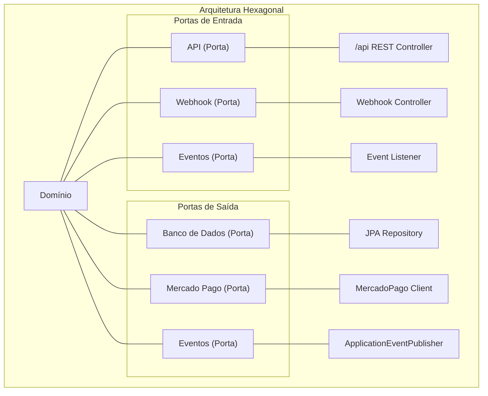
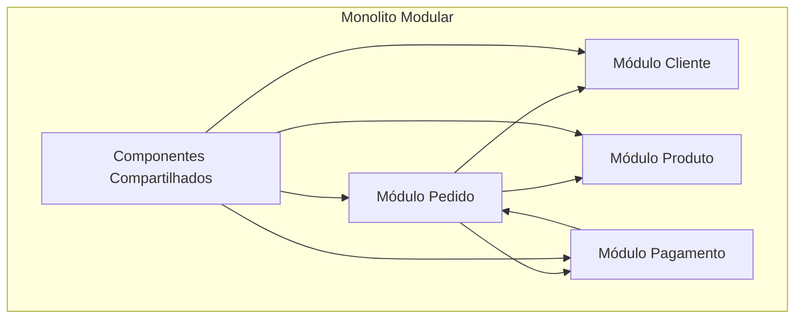
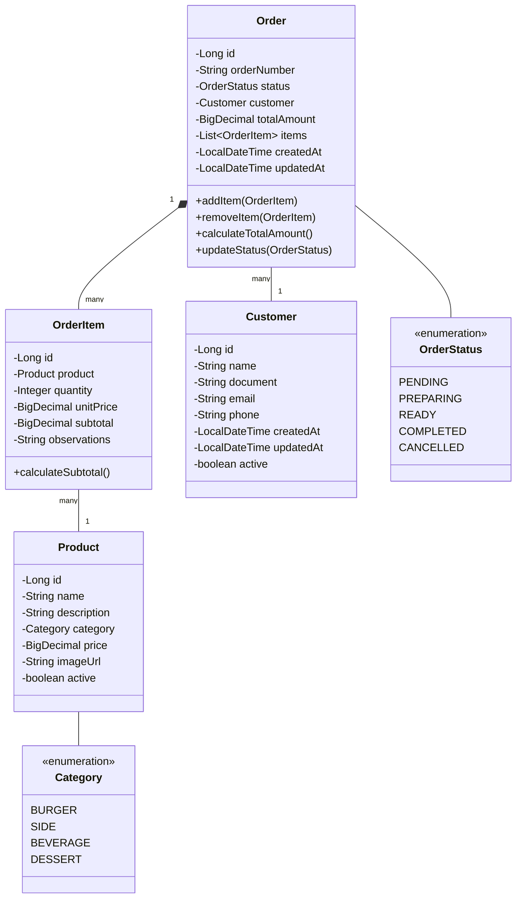
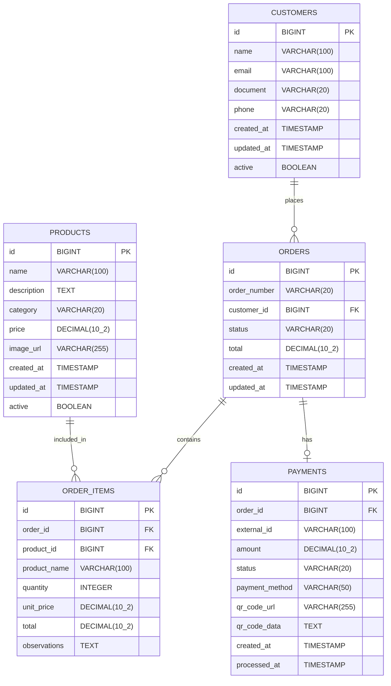
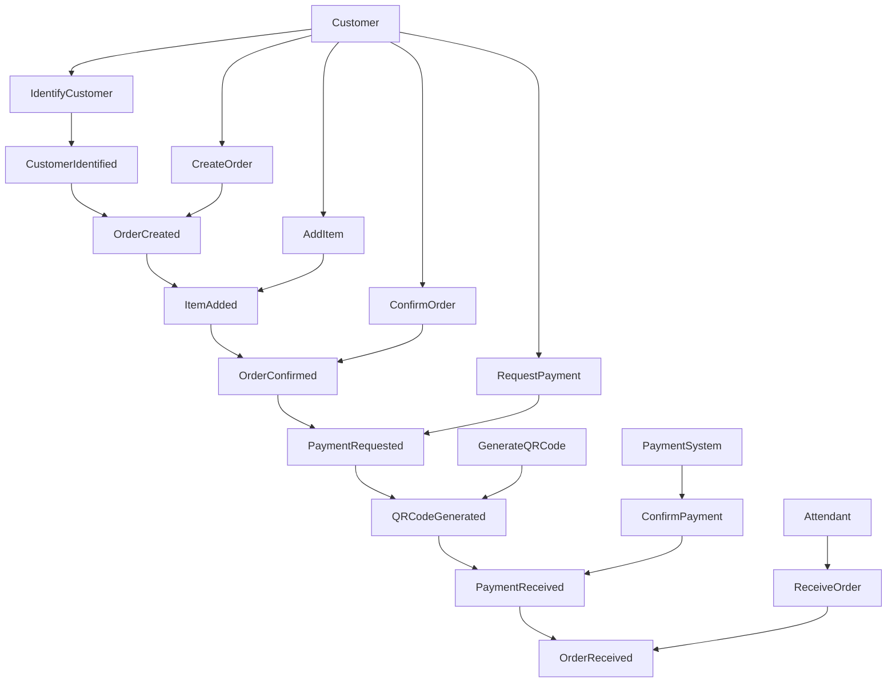
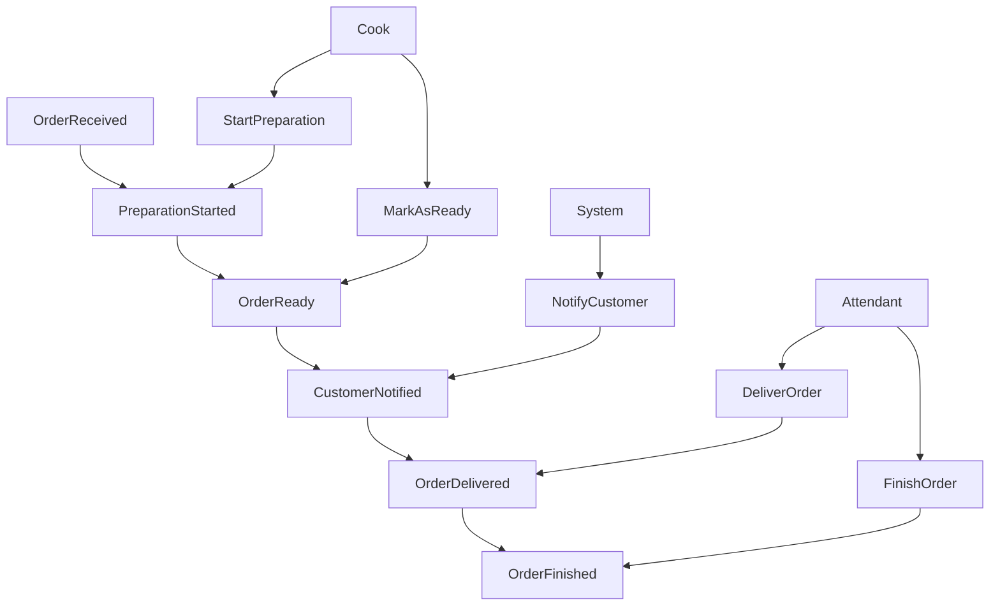

# 🍔 Food Core API

<div align="center">

[](https://sonarcloud.io/summary/new_code?id=soat-fiap_food-core-api)
[](https://sonarcloud.io/summary/new_code?id=soat-fiap_food-core-api)
[](https://sonarcloud.io/summary/new_code?id=soat-fiap_food-core-api)
[](https://sonarcloud.io/summary/new_code?id=soat-fiap_food-core-api)
[](https://sonarcloud.io/summary/new_code?id=soat-fiap_food-core-api)
[](https://github.com/soat-fiap/food-core-api/actions/workflows/tests.yml)
[](https://github.com/soat-fiap/food-core-api/actions/workflows/build.yml)

</div>

API de gerenciamento de pedidos para restaurantes fast-food, desenvolvida como parte do curso de Arquitetura de Software da FIAP (Tech Challenge).

<div align="center">
  <a href="#visao-geral">Visão Geral</a> •
  <a href="#arquitetura">Arquitetura</a> •
  <a href="#tecnologias">Tecnologias</a> •
  <a href="#diagramas">Diagramas</a> •
  <a href="#instalacao-e-uso">Instalação e Uso</a> •
  <a href="#estrutura-do-projeto">Estrutura do Projeto</a> • <br/>
  <a href="#apis">APIs</a> •
  <a href="#banco-de-dados">Banco de Dados</a> •
  <a href="#resolucao-de-problemas">Resolução de Problemas</a> •
  <a href="#contribuicao-e-licenca">Contribuição e Licença</a>
</div>

<h2 id="visao-geral">📋 Visão Geral</h2>

O sistema implementa um serviço de auto-atendimento para uma lanchonete de fast-food, permitindo que os clientes façam pedidos e acompanhem o status do seu pedido sem a necessidade de interação com um atendente. A aplicação também inclui um painel administrativo para gerenciamento de produtos, clientes e acompanhamento de pedidos.

### Principais recursos

- **Auto-atendimento**: Interface para clientes realizarem pedidos
- **Identificação de cliente**: Por CPF ou cadastro com nome e e-mail
- **Pagamento integrado**: Via QRCode do Mercado Pago
- **Acompanhamento de pedido**: Status em tempo real (Recebido, Em preparação, Pronto, Finalizado)
- **Painel administrativo**: Gerenciamento de produtos, categorias e pedidos

<h2 id="arquitetura">🏗️ Arquitetura</h2>

<details>
<summary>Expandir para mais detalhes</summary>

O projeto segue uma arquitetura modular baseada em **Domain-Driven Design (DDD)** com **Spring Modulith** e **Arquitetura Hexagonal**, facilitando a manutenção e promovendo desacoplamento.

### Arquitetura Hexagonal (Ports & Adapters)



### Monolito Modular (Spring Modulith)

A aplicação é estruturada como um monolito modular usando Spring Modulith, com contextos limitados (bounded contexts) bem definidos para cada domínio de negócio:



Cada módulo:

- É autocontido, com seus próprios adaptadores, portas e domínio
- Comunica-se com outros módulos através de eventos de domínio
- Pode ser extraído como um serviço independente no futuro

### Eventos de Domínio

O sistema utiliza eventos de domínio assíncronos entre módulos, permitindo:

- Comunicação desacoplada
- Notificações entre contextos limitados
- Fácil migração para uma arquitetura distribuída no futuro

</details>

<h2 id="tecnologias">🔧 Tecnologias</h2>

<details>
<summary>Expandir para mais detalhes</summary>

### Backend

- **Java 21**: Linguagem principal
- **Spring Boot 3.4**: Framework base
- **Spring Modulith**: Para organização modular da aplicação
- **Spring Data JPA**: Persistência e acesso a dados
- **Spring Security**: Segurança e autenticação
- **MapStruct**: Mapeamento entre DTOs e entidades
- **Lombok**: Redução de código boilerplate

### Banco de Dados & Cache

- **PostgreSQL**: Banco de dados relacional principal
- **Redis**: Cache distribuído
- **Liquibase**: Migrações de banco de dados

### Infraestrutura & Observabilidade

- **Docker**: Containerização
- **Gradle**: Gerenciamento de dependências e builds
- **SonarQube/SonarCloud**: Análise estática de código
- **GitHub Actions**: CI/CD
- **Swagger/OpenAPI**: Documentação de API

### Integração

- **Mercado Pago API**: Processamento de pagamentos

</details>

<h2 id="diagramas">📊 Diagramas</h2>

<details>
<summary>Expandir para mais detalhes</summary>

### Modelo de Domínio



### DER (Diagrama Entidade-Relacionamento)



### Fluxo de Realização do Pedido e Pagamento (Event Storming)



### Fluxo de Preparação e Entrega do Pedido (Event Storming)



</details>

<h2 id="instalacao-e-uso">🚀 Instalação e Uso</h2>

<details>
<summary>Expandir para mais detalhes</summary>

### Requisitos

- Docker e Docker Compose
- JDK 21+
- Gradle 8.0+

### Script Centralizador `food`

O projeto utiliza um script centralizador `food` para gerenciar todas as operações:

```bash
./food [comando] [opções]
```

#### Comandos Principais

| Comando | Descrição |
|---------|-----------|
| `start:all` | Inicia toda a infraestrutura e a aplicação |
| `start:infra` | Inicia apenas a infraestrutura (banco, redis, cdn) |
| `start:app` | Inicia apenas a aplicação |
| `stop:all` | Para todos os serviços |
| `stop:infra` | Para apenas a infraestrutura |
| `stop:app` | Para apenas a aplicação |
| `restart:all` | Reinicia todos os serviços |
| `restart:app` | Reinicia apenas a aplicação |
| `db:up` | Aplica migrações do banco de dados |
| `db:reset` | Reseta o banco de dados |
| `logs` | Exibe logs dos containers |
| `logs:app` | Exibe logs apenas da aplicação |
| `logs:db` | Exibe logs apenas do banco de dados |
| `status` | Exibe status dos containers |
| `clean` | Remove containers, imagens e volumes não utilizados |
| `help` | Exibe a mensagem de ajuda |

#### Opções

- `--build`, `-b`: Reconstrói as imagens antes de iniciar
- `--force`, `-f`: Força a execução sem confirmação

### Iniciando o Ambiente do Zero

```bash
# Clone o repositório
git clone https://github.com/soat-fiap/food-core-api.git
cd food-core-api

# Tornar o script principal executável
chmod +x food

# Iniciar infraestrutura (banco, redis, cdn, adminer)
./food start:infra

# Resetar e configurar o banco de dados
./food db:reset

# Iniciar a aplicação
./food start:app --build

# Ou iniciar tudo de uma vez
./food start:all --build
```

### Acessando a Aplicação

- **API**: <http://localhost:8083/api>
- **Swagger/OpenAPI**: <http://localhost:8083/swagger-ui.html>
- **Adminer (gerenciador de banco de dados)**: <http://localhost:8081>
  - Sistema: PostgreSQL
  - Servidor: db
  - Usuário: postgres
  - Senha: postgres
  - Banco: fastfood
- **CDN**: <http://localhost:8082>

### Ambientes e Dados de Seed

O projeto suporta diferentes ambientes com diferentes conjuntos de dados:

- **Produção (perfil: prod)**: Apenas dados essenciais
- **Desenvolvimento (perfil: dev/local)**: Dados essenciais + dados adicionais para testes

Para executar a aplicação em modo de desenvolvimento:

```bash
# Usando variável de ambiente SPRING_PROFILES_ACTIVE
SPRING_PROFILES_ACTIVE=dev ./gradlew bootRun

# Ou usando parâmetro na linha de comando
./gradlew bootRun --args='--spring.profiles.active=local'
```

</details>

<h2 id="estrutura-do-projeto">📁 Estrutura do Projeto</h2>

<details>
<summary>Expandir para mais detalhes</summary>

O projeto segue uma estrutura modular organizada por domínios:

```
food-core-api/
│
├── src/
│   ├── main/
│   │   ├── java/com/soat/fiap/food/core/api/
│   │   │   ├── FoodCoreApiApplication.java     # Aplicação principal
│   │   │   │
│   │   │   ├── order/                          # Módulo Pedido
│   │   │   │   ├── application/                # Portas e serviços de aplicação
│   │   │   │   ├── domain/                     # Modelos de domínio e regras de negócio
│   │   │   │   ├── mapper/                     # Mappers entre domínio e DTOs
│   │   │   │   └── infrastructure/             # Implementações de adaptadores
│   │   │   │
│   │   │   ├── customer/                       # Módulo Cliente
│   │   │   ├── product/                        # Módulo Produto 
│   │   │   ├── payment/                        # Módulo Pagamento
│   │   │   └── shared/                         # Componentes compartilhados
│   │   │
│   │   └── resources/
│   │       ├── application.yml                 # Configurações gerais
│   │       ├── application-dev.yml             # Configurações de desenvolvimento
│   │       ├── application-prod.yml            # Configurações de produção
│   │       └── db/changelog/                   # Migrações Liquibase
│   │
│   └── test/                                   # Testes
│
├── docker/                                     # Arquivos Docker
│   ├── Dockerfile
│   ├── docker-compose.yml
│   └── services/                               # Serviços adicionais
│
├── scripts/                                    # Scripts de gerenciamento
│
├── docs/                                       # Documentação
│
├── food                                        # Script centralizador
└── README.md                                   # Este arquivo
```

### Organização Modular (DDD / Arquitetura Hexagonal)

Cada módulo segue a mesma estrutura, implementando a arquitetura hexagonal:

```
módulo/
├── application/                          # Camada de aplicação
│   ├── ports/                            # Portas
│   │   ├── in/                           # Portas de entrada
│   │   │   └── ModuloUseCase.java
│   │   └── out/                          # Portas de saída
│   │       └── ModuloRepository.java
│   └── services/                         # Serviços de aplicação
│       └── ModuloService.java
├── domain/                               # Domínio
│   ├── model/                            # Entidades e objetos de valor
│   │   ├── Entidade.java
│   │   └── ObjetoValor.java
│   ├── events/                           # Eventos de domínio
│   │   └── EntidadeCreatedEvent.java
│   └── exception/                        # Exceções de domínio
├── mapper/                               # Mappers entre domínio e DTOs
│   └── ModuloDtoMapper.java
└── infrastructure/                       # Infraestrutura
    ├── adapters/                         # Adaptadores
    │   ├── in/                           # Adaptadores de entrada
    │   │   ├── controller/               # Controllers REST
    │   │   │   └── ModuloController.java
    │   │   └── dto/                      # DTOs para comunicação externa
    │   │       ├── request/              # DTOs de requisição
    │   │       └── response/             # DTOs de resposta
    │   └── out/                          # Adaptadores de saída
    │       ├── persistence/              # Persistência de dados
    │       │   ├── entity/               # Entidades JPA
    │       │   ├── mapper/               # Mappers entre entidades e domínio
    │       │   └── repository/           # Repositórios Spring Data
    │       └── integration/              # Integrações com serviços externos
    └── config/                           # Configurações específicas do módulo
```

</details>

<h2 id="apis">🌐 APIs</h2>

<details>
<summary>Expandir para mais detalhes</summary>

O sistema expõe duas interfaces principais de API:

1. **API de Auto-Atendimento**: Para clientes se identificarem, visualizarem produtos e fazerem pedidos
2. **API de Gestão**: Para administradores gerenciarem produtos, categorias e pedidos

### Endpoints Principais

#### Clientes

```
POST /api/customers                     # Cadastrar cliente
GET /api/customers/{document}           # Obter cliente por documento
GET /api/customers                      # Listar clientes
```

#### Produtos

```
GET /api/products                       # Listar produtos
GET /api/products?category={category}   # Listar produtos por categoria
GET /api/products/{id}                  # Obter produto por ID
```

#### Pedidos

```
POST /api/orders                        # Criar pedido
GET /api/orders                         # Listar pedidos
GET /api/orders?status={status}         # Listar pedidos por status
GET /api/orders/{id}                    # Obter pedido por ID
PATCH /api/orders/{id}/status           # Atualizar status do pedido
POST /api/orders/{id}/items             # Adicionar item ao pedido
```

#### Pagamentos

```
POST /api/orders/{orderId}/payments     # Processar pagamento
GET /api/orders/{orderId}/payments      # Obter informações de pagamento
```

Para documentação completa e interativa, consulte o Swagger/OpenAPI disponível em:
<http://localhost:8083/swagger-ui.html>

</details>

<h2 id="banco-de-dados">💾 Banco de Dados</h2>

<details>
<summary>Expandir para mais detalhes</summary>

### Modelo Relacional

O sistema utiliza PostgreSQL como banco de dados principal, com o seguinte esquema:


### Gerenciamento de Migrações

O projeto utiliza Liquibase para gerenciar migrações de banco de dados, organizadas por módulo:

```
src/main/resources/db/changelog/
├── db.changelog-master.yaml          # Arquivo principal
├── modules/                          # Migrations separadas por módulo
│   ├── order/
│   │   ├── 01-order-tables.sql
│   │   ├── 02-order-indexes.sql
│   │   └── 03-order-seed.sql
│   ├── customer/
│   ├── product/
│   └── payment/
└── shared/
    └── 00-init-schema.sql
```

As migrações são aplicadas automaticamente durante a inicialização da aplicação, mas também podem ser executadas manualmente:

```bash
./food db:up     # Aplicar migrações
./food db:reset  # Resetar e recriar o banco de dados
```

### Acesso ao Banco de Dados

Para acessar o banco de dados durante o desenvolvimento, utilize o Adminer disponível em:
<http://localhost:8081>

Credenciais:

- Sistema: PostgreSQL
- Servidor: db
- Usuário: postgres
- Senha: postgres
- Banco: fastfood

</details>

<h2 id="resolucao-de-problemas">🔍 Resolução de Problemas</h2>

<details>
<summary>Expandir para mais detalhes</summary>

### Problemas com o Banco de Dados

Se você encontrar erros ao tentar resetar o banco de dados, como:

```
ERROR: database "fastfood" is being accessed by other users
DETAIL: There are X other sessions using the database.
```

Tente estes passos:

```bash
# 1. Parar todos os serviços
./food stop:all

# 2. Limpar recursos Docker não utilizados
./food clean --force

# 3. Iniciar apenas a infraestrutura
./food start:infra

# 4. Tentar o reset novamente
./food db:reset --force
```

### Erros do Liquibase

Se você encontrar erros de validação do Liquibase como:

```
Validation Failed:
     changesets check sum
     changesets had duplicate identifiers
```

Existem duas abordagens:

1. **Limpar completamente o banco de dados:**

```bash
# Parar todos os serviços
./food stop:all

# Limpar recursos
./food clean --force

# Iniciar tudo novamente
./food start:all --build
```

2. **Atualizar a tabela DATABASECHANGELOG (para desenvolvedores):**

```sql
-- Conecte-se ao banco via Adminer e execute:
DELETE FROM DATABASECHANGELOG 
WHERE filename = 'db/changelog/modules/product/03-product-seed.sql';

-- Aplique as migrações novamente
./food db:up
```

### Problemas com o Docker

Se o Docker travar ou apresentar problemas:

```bash
# Reinicie o Docker Desktop
# Em seguida, reinicie a infraestrutura
./food restart:all --build
```

### Porta em Uso

Se alguma porta estiver em uso (como 8080, 8081, 8082, 8083, 5432, 6379):

1. Identifique o processo usando a porta:

   ```bash
   lsof -i :<número-da-porta>
   ```

2. Encerre o processo ou altere a porta no arquivo `docker/docker-compose.yml`

</details>

<h2 id="contribuicao-e-licenca">🙏 Contribuição e Licença</h2>

### Guia de Contribuição

Para contribuir com o projeto, siga estas etapas:

#### Branches

- A branch principal de desenvolvimento é a `main`
- Para novas funcionalidades, crie uma branch a partir da `main` seguindo o padrão:
  - `feature/nome-da-funcionalidade`
- Para correções de bugs, use o padrão:
  - `fix/descricao-do-bug`
- Para documentação:
  - `docs/descricao-da-documentacao`
- Para melhorias de performance ou refatoração:
  - `refactor/descricao-da-mudanca`

#### Commits

Siga a convenção [Conventional Commits](https://www.conventionalcommits.org/):

```
<tipo>[escopo opcional]: <descrição>

[corpo opcional]

[rodapé(s) opcional(is)]
```

Exemplos:

- `feat(order): adiciona endpoint para cancelamento de pedido`
- `fix(customer): corrige validação de CPF`
- `docs: atualiza README com novas instruções`
- `refactor(product): melhora desempenho na listagem de produtos`

#### Pull Requests

1. Certifique-se que sua branch está atualizada com a `main`
2. Faça um pull request para a branch `main`
3. Descreva as alterações realizadas de forma clara
4. Vincule issues relacionadas
5. Aguarde a revisão dos mantenedores

---

### Contribuidores

Este projeto é mantido por:

- [Caio Souza](https://github.com/caiuzu)
- [Guilherme Cesar](https://github.com/QuatroQuatros)
- [Marcelo Maga](https://github.com/marcelo-maga)
- [Pedro Ferrarezzo](https://github.com/pedroferrarezzo)

---

### Licença

Este projeto está licenciado sob a licença MIT.
